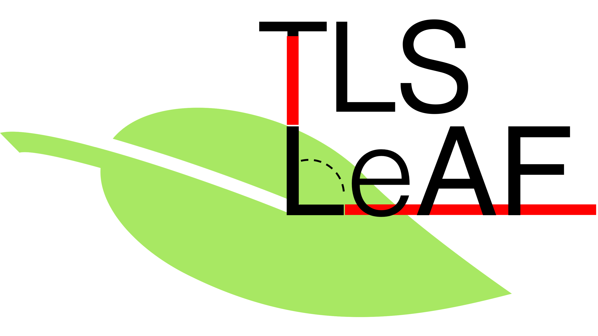
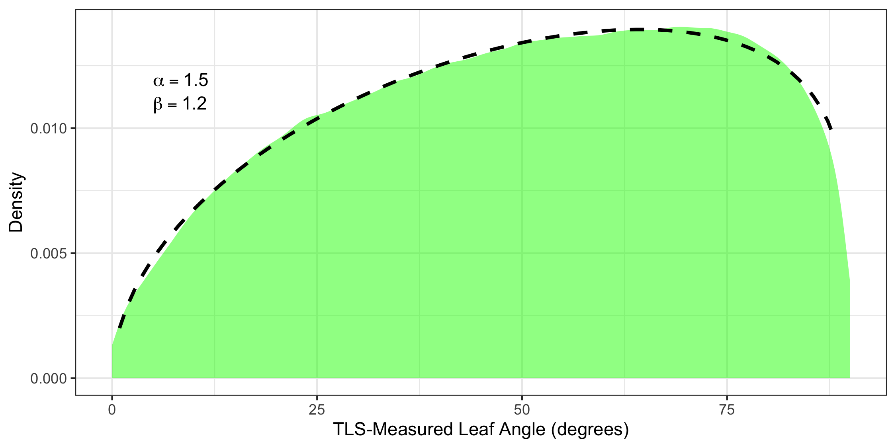
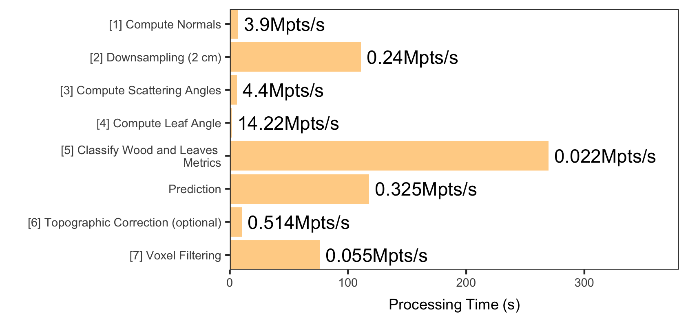

# TLSLeAF - Terrestrial Laser Scanning Leaf Angle Function
Algorithms described in "Automatic leaf angle estimates from single-scan terrestrial laser scanning with TLSLeAF" (Stovall et al. Submitted) for generating leaf angle distributions (LADs) from single-scan terrestrial laser scanning (TLS) data. 

TLSLeAF is based in the R programming language and takes advantage of CloudCompare commandline tools. 

## INITIAL SETUP

Add your gridded TLS data in the "input" folder.

```{r,echo=FALSE}
files<-list.files(pattern = "ptx", 
                  recursive = TRUE, 
                  full.names = TRUE)
i=1

input_file = files[i]
output_file = gsub(".ptx",".asc", input_file)
```

## EDIT THE SETUP FILE FOR YOUR SYSTEM

Make sure the setup file is correct and save. The most important step is to have Cloud Compare installed and add the executable path into the setup file.

```{r,echo=FALSE}
file.edit('R/000_setup.R')
```

Add your operating system type and specify the path to CloudCompare. Further testing is necessary to ensure this works on a Windows machine.

Two setup option are available: 

```{r,echo=FALSE}
SCATTER_LIM = 85 #threshold of scattering angle to remove
correct.topography = TRUE #topographically normalize the voxels?
```
`SCATTER_LIM` is a filter based on the angle of reflection of the laser pulse, relative to the normal of the leaf surface. For instance, a 0 degree scattering angle would be found for surfaces perpendicular to the laser trajectory. A 90 degree angle would be a surface parallel to the laser trajectory. The algorithm filters scattering angles greater than 85 degrees by default.

`correct.topography` creates a surface model from the TLS data and normalizes returns and angles according to the ground surface.

## RUN THE PIPELINE

Load packages, functions, and input parameters.
```{r,echo=FALSE}
source('R/000_setup.R')
```

Load in your TLS file in PTX format (other gridded formats may work, but are untested).
```{r,echo=FALSE}
files<-list.files(pattern = "ptx", 
                  recursive = TRUE, 
                  full.names = TRUE)
input_file = files[1]

```

Find center coordinates. Modify the `center` variable according to file format.
```{r,echo=FALSE}

center<-fread(input_file, nrows=4, header=FALSE)[1,]
colnames(center)<-c("x","y","z")
```

FINALLY, Run TLSLeAF. The output from the following default parameters will be of the `TLSLeAF.class`, allowing access to all intermediate products used to create the leaf angle distribution.
```{r,echo=FALSE}
df<-TLSLeAF(input_file, 
            overwrite=TRUE,
            center, 
            SCATTER_LIM=85,
            SS=0.02, 
            scales=c(0.1,0.5,0.75),
            rf_model,
            vox.res=5,
            minVoxDensity=5,
            superDF=TRUE)
```

Success (hopefully)! You will find all of the processed files in the `output` directory.
The `figures` folder should also include a LAD figure with beta parameters from TLSLeAF:




## How fast is it?

TLSLeAF is an efficient means of calculating single-scan leaf angles and LADs. One can expect processing times in line with the figure below on a consumer-grade machine.


